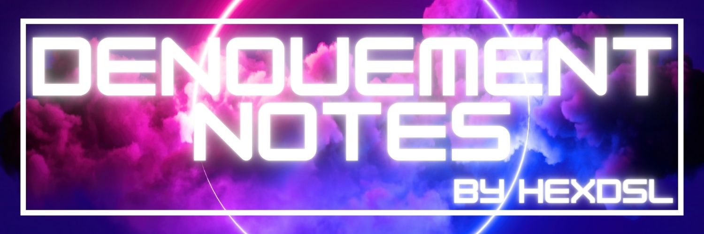

Denouement is the name of my second book and the first in the Denouemeverse science-fiction setting. 

This section contains my live(ish) 'wiki' for the Denouement continuity. 

> [!danger] STOP!
> **If you have not read the Denouement books please be aware that there *will* be spoilers.** 
> Also, this is a live document and very much a work in progress, there is still quite a lot which is missing at this time.

This also contains unused plot points and stubs. The intent for this is to be used as a deeper reference for those who want it or an interesting look behind the curtain for those trying to write their own books. 

# Books

## Main

[[Denouement 1]] - Echoes of the goddess

[[Denouement 2]] - In Her we Trust

[[Denouement 3]] - A Thousand years North *(writing)*

## Short story collections

[[Tales of 1]] - Week

[[Tales of 2]] - Of Gods and Vampires *(writing)*

# How to read! 
Use the side bar, on the left to explore the folder structure. 

You will find lots of entries in the side bar. If you do explore it, you are into the work-in-progress-mad-ramblings section and that's on you.

Looks like this 👇🏻 but you get it over there 👈🏻
![[Pasted image 20240217114619.png]]

